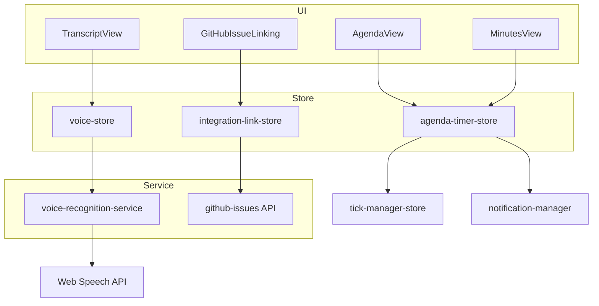
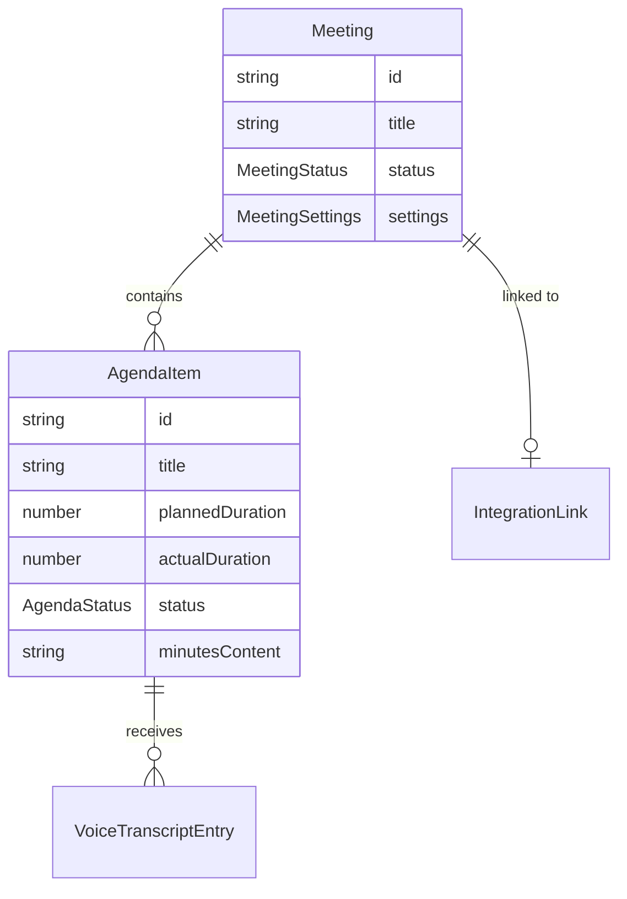

# 設計書: アジェンダタイマー

## 概要

**目的**: 会議の議題進行を時間管理し、議事録・音声文字起こし・GitHub Issue 連携を統合した会議支援機能を提供する。
**ユーザー**: 会議主催者・参加者が、計画的な会議進行と議事録作成に利用する。
**影響**: Focuso の最大規模機能。会議レポート・分析ダッシュボード・MAPE-K にデータを供給する。

### ゴール
- 議題ごとの予定時間管理と進行状況のリアルタイム表示
- 通知制御（5 分前/終了/超過）と会議設定の永続化
- Quill による議事録入力（PC/モバイル対応）
- Web Speech API による音声文字起こしと議事録挿入
- GitHub Issue からの会議下書き自動生成

### ノンゴール
- リアルタイム共同編集
- 外部カレンダー連携

## アーキテクチャ

### アーキテクチャパターン



### 技術スタック

| レイヤー | 選択                        | 役割                         |
| -------- | --------------------------- | ---------------------------- |
| UI       | React 18 + Radix UI + Quill | 議題進行・議事録・文字起こし |
| 状態管理 | Zustand 4 (persist)         | 会議・議題・音声状態         |
| 音声認識 | Web Speech API              | ブラウザ内蔵音声認識         |
| 外部 API | GitHub REST API             | Issue 取得                   |
| 通知     | notification-manager        | ベル通知・超過通知           |

## 要件トレーサビリティ

| 要件 | 概要              | コンポーネント                                                |
| ---- | ----------------- | ------------------------------------------------------------- |
| 1    | 会議・議題管理    | AgendaView, agenda-timer-store                                |
| 2    | 議題進行表示      | AgendaView, agenda-timer-store, notification-manager          |
| 3    | 会議設定          | agenda-timer-store                                            |
| 4    | 議事録入力        | MinutesView (Quill), agenda-timer-store                       |
| 5    | 音声文字起こし    | TranscriptView, voice-store, voice-recognition-service        |
| 6    | GitHub Issue 連携 | GitHubIssueLinking, integration-link-store, github-issues API |

## コンポーネントとインターフェース

| コンポーネント            | レイヤー | 責務                                  | 要件       |
| ------------------------- | -------- | ------------------------------------- | ---------- |
| AgendaView                | UI       | 議題リスト・進行表示・通知制御        | 1, 2, 3    |
| MinutesView               | UI       | Quill エディタによる議事録入力        | 4          |
| TranscriptView            | UI       | 音声認識プレビュー・挿入              | 5          |
| GitHubIssueLinking        | UI       | Issue 入力・候補確認                  | 6          |
| agenda-timer-store        | Store    | 会議・議題の CRUD・タイムトラッキング | 1, 2, 3, 4 |
| voice-store               | Store    | 音声認識状態管理                      | 5          |
| integration-link-store    | Store    | GitHub 連携・PAT 管理                 | 6          |
| voice-recognition-service | Service  | Web Speech API ラッパー               | 5          |
| github-issues API         | API      | GitHub REST API クライアント          | 6          |

### ストア層

#### agenda-timer-store

| 項目 | 詳細                                           |
| ---- | ---------------------------------------------- |
| 責務 | 会議ライフサイクル管理、議題進行、通知トリガー |
| 要件 | 1, 2, 3, 4                                     |

**状態管理**

```typescript
// src/types/agenda.ts に定義済み
interface AgendaTimerState {
  currentMeeting: Meeting | null;
  meetings: Meeting[];
  isRunning: boolean;
  currentTime: number;
  meetingStartTime?: Date;
  lastTickTime?: number;
}
```

- 600+ 行の大規模ストア
- 議題ステータス遷移: pending → running → paused → completed/overtime
- ベル通知: `bellSettings` に基づく 5 分前/終了/超過の条件判定
- 永続化: `meetings` を localStorage に保存

#### voice-store

```typescript
// src/types/voice.ts に定義済み
interface VoiceState {
  isSupported: boolean;
  isListening: boolean;
  language: 'ja-JP' | 'en-US';
  interimTranscript: string;
  confirmedEntries: VoiceTranscriptEntry[];
  error: 'permission-denied' | 'not-supported' | 'network' | 'aborted' | null;
  currentAgendaId: string | null;
}
```

## データモデル

### ドメインモデル



## エラーハンドリング

- Web Speech API 非対応: `isSupported: false` → ボタングレーアウト
- GitHub API 取得失敗: エラートースト → 手動入力フォールバック
- 音声認識エラー: `permission-denied` / `network` / `aborted` をユーザーに表示

## テスト戦略

- ユニットテスト: agenda-timer-store の議題遷移・通知判定、voice-store の状態遷移
- 統合テスト: 会議作成→議題進行→完了の E2E フロー
- エッジケース: 全議題超過、音声認識の自動再起動、GitHub API タイムアウト
