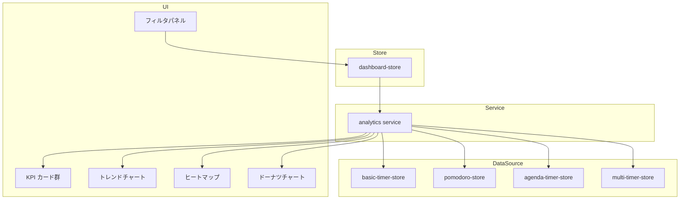

# 設計書: 分析ダッシュボード

## 概要

**目的**: タイマー・ポモドーロ・会議のデータを日次/週次/月次で可視化し、集中度・達成率・時間効率を分析する。
**ユーザー**: 個人が作業パターンの把握と改善に利用する。

### ゴール
- 日次/週次/月次の KPI 可視化（集中時間・セッション数・完了率）
- ポモドーロ分析（達成率・休憩比率・連続達成日数）
- 会議分析（予実差分・超過率）
- 多軸フィルタリング（種別/カテゴリ/会議/期間）
- CSV / Markdown エクスポート

### ノンゴール
- リアルタイムストリーミング分析
- チーム横断分析

## アーキテクチャ

### アーキテクチャパターン



### 技術スタック

| レイヤー | 選択 | 役割 |
|---------|------|------|
| UI | React 18 + Recharts v3 | チャート描画 |
| 状態管理 | Zustand 4 (persist) | フィルタ状態の永続化 |
| 分析エンジン | analytics service | KPI/トレンド/ヒートマップ/ドーナッツ計算 |

## 要件トレーサビリティ

| 要件 | 概要 | コンポーネント |
|------|------|---------------|
| 1 | 集中時間・セッション可視化 | KPI カード, トレンドチャート |
| 2 | ポモドーロ分析 | KPI カード |
| 3 | 会議分析 | KPI カード |
| 4 | フィルタリング | フィルタパネル, dashboard-store |
| 5 | データエクスポート | エクスポートボタン |

## コンポーネントとインターフェース

| コンポーネント | レイヤー | 責務 | 要件 |
|---------------|---------|------|------|
| KPI カード群 | UI | 集中時間/セッション数/達成率/超過率の表示 | 1, 2, 3 |
| トレンドチャート | UI | 時系列グラフ | 1 |
| ヒートマップ | UI | 曜日×時間帯の集中マップ | 1 |
| ドーナツチャート | UI | タイマー種別分布 | 1 |
| フィルタパネル | UI | フィルタ条件の選択 | 4 |
| dashboard-store | Store | フィルタ状態管理 | 4 |
| analytics service | Service | 集計計算エンジン | 1, 2, 3, 5 |

### サービス層

#### analytics service

| 項目 | 詳細 |
|------|------|
| 責務 | 各ストアのセッションデータを集計し、KPI/トレンド/ヒートマップ/ドーナッツを計算 |
| 要件 | 1, 2, 3, 5 |

**インターフェース**

```typescript
// src/types/analytics.ts に定義済み
interface AnalyticsResult {
  kpi: KpiSummary;
  trend: TrendPoint[];
  heatmap: HeatmapCell[];
  donut: DonutSegment[];
}

function computeAnalytics(filter: AnalyticsFilter): AnalyticsResult;
```

- 非機能要件: 3 秒以内の初期レンダリング（直近 90 日データ想定）
- フィルタ適用時: 全指標をリアクティブに再計算

## データモデル

- 入力: 各ストアの `sessions` / `history` / `meetings`
- 出力: `AnalyticsResult`（`src/types/analytics.ts` に定義済み）
- フィルタ: `AnalyticsFilter { since, until, granularity, timerKind }`

## テスト戦略

- ユニットテスト: analytics service の KPI/トレンド/ヒートマップ/ドーナッツ計算
- 統合テスト: フィルタ変更→チャート更新のフロー
- パフォーマンステスト: 90 日データでの初期レンダリング時間
