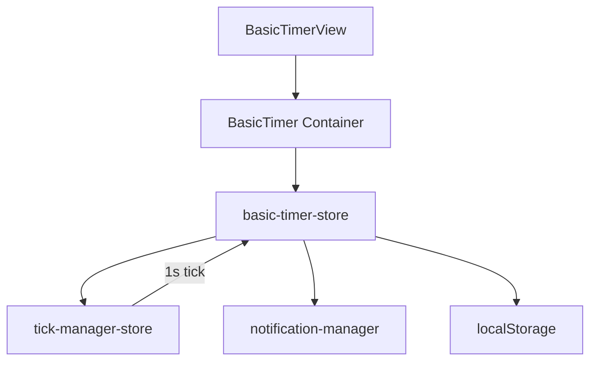
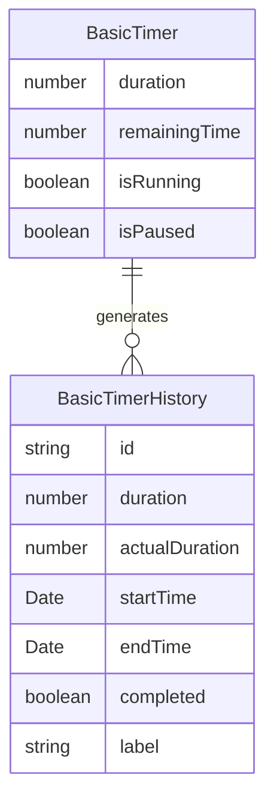

# 設計書: 基本タイマー

## 概要

**目的**: 分単位で設定可能なカウントダウンタイマーを提供し、作業時間の計測と実行履歴の記録を行う。
**ユーザー**: 個人作業者が集中作業やタスクの時間管理に利用する。
**影響**: Focuso のコア機能として、ポモドーロ・マルチタイマーと共通の tick 基盤を共有する。

### ゴール
- 分単位カウントダウンの正確な動作
- 開始/一時停止/停止/リセットの直感的操作
- 実行履歴の永続化と完了/中断の区別

### ノンゴール
- 秒単位未満の精度
- 複数タイマーの同時管理（multi-timer が担当）

## アーキテクチャ

### アーキテクチャパターン



**選択パターン**: Feature-first + Zustand store（パーインスタンス状態管理）

### 技術スタック

| レイヤー | 選択 | 役割 |
|---------|------|------|
| UI | React 18 + Radix UI | タイマー表示・操作ボタン |
| 状態管理 | Zustand 4 (persist) | タイマー状態・履歴の永続化 |
| ティック | tick-manager-store | 1 秒間隔のグローバル tick 配信 |
| 通知 | notification-manager | 完了時のブラウザ/トースト通知 |

## 要件トレーサビリティ

| 要件 | 概要 | コンポーネント |
|------|------|---------------|
| 1 | カウントダウンタイマー | BasicTimerView, basic-timer-store |
| 2 | タイマー操作 | BasicTimerView, basic-timer-store |
| 3 | 実行履歴 | basic-timer-store, TimerHistory |

## コンポーネントとインターフェース

| コンポーネント | レイヤー | 責務 | 要件 |
|---------------|---------|------|------|
| BasicTimerView | UI | タイマー表示・操作 UI | 1, 2 |
| BasicTimer | Container | ストア接続の配線 | 1, 2, 3 |
| basic-timer-store | Store | 状態管理・履歴記録 | 1, 2, 3 |
| TimerHistory | UI | 履歴一覧表示 | 3 |

### ストア層

#### basic-timer-store

| 項目 | 詳細 |
|------|------|
| 責務 | 基本タイマーの状態管理、履歴の永続化 |
| 要件 | 1, 2, 3 |

**状態管理**

```typescript
interface BasicTimerState {
  duration: number;          // 設定時間（秒）
  remainingTime: number;     // 残り時間（秒）
  isRunning: boolean;
  isPaused: boolean;
  history: BasicTimerHistory[];
}

interface BasicTimerActions {
  setDuration: (minutes: number) => void;
  start: () => void;
  pause: () => void;
  stop: () => void;
  reset: () => void;
  tick: () => void;
}
```

- 永続化: `zustand/persist` で localStorage に保存
- tick: `tick-manager-store` から 1 秒ごとに `tick()` を呼び出し

## データモデル

### ドメインモデル



- `BasicTimerHistory`: `src/types/timer.ts` に定義済み
- 完了時は `completed: true`、中断時は `completed: false`

## エラーハンドリング

- タイマー値が 0 以下の場合: バリデーションで開始を拒否
- tick 時のバックグラウンドタブ対応: `lastTickTime` による補正

## テスト戦略

- ユニットテスト: `basic-timer-store` の start/pause/stop/reset/tick
- 統合テスト: BasicTimerView でのユーザー操作シナリオ
- エッジケース: バックグラウンドタブ復帰、0 到達時の通知
