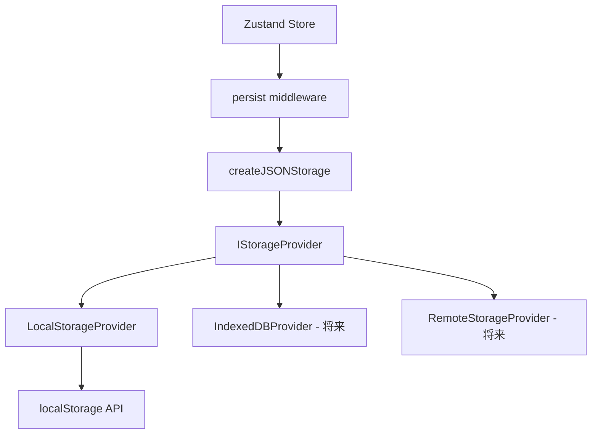
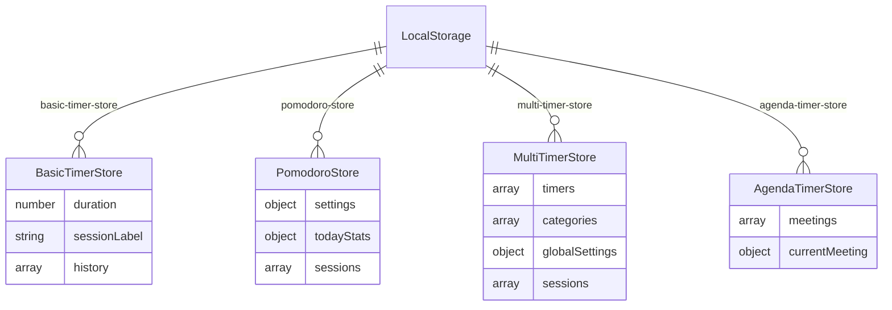

# 設計書: データ永続化

## 概要

**目的**: 全タイマーストアのユーザーデータを localStorage に永続化し、ブラウザリロード後のデータ消失を防止する。将来的な DB 移行に備え、ストレージバックエンドを抽象化する。
**ユーザー**: Focuso の全ユーザー（タイマー機能利用者）
**影響**: 基本タイマー / ポモドーロ / 複数タイマー / アジェンダタイマーの 4 ストアに Zustand `persist` ミドルウェアを追加。既存の永続化済みストア（task-store 等）は変更なし。

### ゴール

- 全タイマーストアのユーザーデータ（設定・履歴・会議データ）の永続化
- ランタイム状態（isRunning, lastTickTime 等）の除外による安全なリストア
- `IStorageProvider` による将来的な DB 移行パスの確保

### ノンゴール

- IndexedDB / リモートDB の実装（Phase 2/3 として記録のみ）
- データのエクスポート / インポート機能
- バージョンマイグレーション（スキーマ変更時に追加）

## アーキテクチャ

### アーキテクチャパターン



**選択パターン**: Strategy パターンによるストレージバックエンド抽象化 + Zustand persist ミドルウェア

### 技術スタック

| レイヤー | 選択 | 役割 |
|---------|------|------|
| 永続化 | Zustand persist middleware | ストア状態の自動保存/復元 |
| シリアライズ | createJSONStorage | JSON シリアライズ/デシリアライズ |
| 抽象化 | IStorageProvider | ストレージバックエンドの差し替え |
| ストレージ | localStorage | デフォルトのストレージバックエンド |

## 要件トレーサビリティ

| 要件 | 概要 | コンポーネント |
|------|------|---------------|
| 1 | ストレージアダプター抽象化 | storage-adapter.ts |
| 2 | 基本タイマー永続化 | basic-timer-store.ts |
| 3 | ポモドーロ永続化 | pomodoro-store.ts |
| 4 | 複数タイマー永続化 | multi-timer-store.ts |
| 5 | アジェンダタイマー永続化 | agenda-timer-store.ts |
| 6 | セキュリティ | 全ストアの partialize 設定 |

## コンポーネントとインターフェース

| コンポーネント | レイヤー | 責務 | 要件 |
|---------------|---------|------|------|
| storage-adapter.ts | Utils | ストレージプロバイダーの抽象化・差し替え | 1 |
| basic-timer-store.ts | Store | 基本タイマー状態の永続化 | 2, 6 |
| pomodoro-store.ts | Store | ポモドーロ状態の永続化 | 3, 6 |
| multi-timer-store.ts | Store | 複数タイマー状態の永続化 | 4, 6 |
| agenda-timer-store.ts | Store | アジェンダタイマー状態の永続化 | 5, 6 |

### ストレージアダプター層

#### IStorageProvider

```typescript
export interface IStorageProvider {
  getItem: (name: string) => string | null | Promise<string | null>;
  setItem: (name: string, value: string) => void | Promise<void>;
  removeItem: (name: string) => void | Promise<void>;
}
```

- `getStorageProvider()`: 現在のプロバイダーを返す
- `setStorageProvider(provider)`: プロバイダーを差し替え
- デフォルト: `LocalStorageProvider`（localStorage ラッパー）

### ストア層

#### 永続化設定（partialize）

各ストアは `partialize` でランタイム状態を除外し、ユーザーデータのみを永続化する。

| ストア | 永続化フィールド | 除外フィールド |
|--------|-----------------|---------------|
| `basic-timer-store` | duration, sessionLabel, history | isRunning, isPaused, remainingTime, sessionId, sessionStartTime, lastTickTime |
| `pomodoro-store` | settings, todayStats, sessions | isRunning, isPaused, currentPhase, timeRemaining, cycle, totalCycles, taskName, lastTickTime |
| `multi-timer-store` | timers（実行状態リセット）, categories, globalSettings, sessions | isAnyRunning |
| `agenda-timer-store` | meetings, currentMeeting | isRunning, currentTime, meetingStartTime, lastTickTime |

#### merge 関数

各ストアは `merge` 関数でリストア時にランタイム状態をデフォルト値に初期化する。

```typescript
merge: (persisted, current) => {
  // 保存データを復元
  // ランタイム状態はデフォルト値で初期化
  // Date オブジェクトは new Date() で再構築
  // remainingTime は duration から復元
}
```

## データモデル

### LocalStorage キー一覧



| キー名 | ストア |
|--------|--------|
| `basic-timer-store` | BasicTimerStore |
| `pomodoro-store` | PomodoroStore |
| `multi-timer-store` | MultiTimerStore |
| `agenda-timer-store` | AgendaTimerStore |

## エラーハンドリング

- localStorage 未対応環境: Zustand persist のデフォルトフォールバック（メモリのみ）
- 破損データ: `merge` 関数でデフォルト値にフォールバック
- 容量超過: ブラウザ依存（5–10 MB）、将来の IndexedDB 移行で対応

## テスト戦略

- ユニットテスト: `storage-adapter.test.ts` — プロバイダーの CRUD 操作・差し替え
- ユニットテスト: `store-persistence.test.ts` — 各ストアの partialize 検証（ランタイム状態除外の確認）
- エッジケース: データなしリストア、部分データリストア

## 将来の拡張パス

### Phase 2: IndexedDB

- `IndexedDBProvider` を実装し `setStorageProvider()` で差し替え
- 大容量データ対応（数百 MB）
- トランザクション対応

### Phase 3: リモートDB同期

- `RemoteStorageProvider` を実装
- オンライン/オフライン同期
- マルチデバイス対応
- 競合解決ロジック
