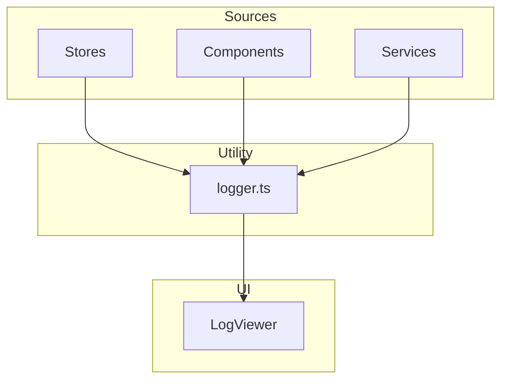

# 設計書: ログ・障害調査

## 概要

**目的**: 操作ログとエラーログを構造的に記録・閲覧し、障害時の原因調査と AI 解析を支援する。
**ユーザー**: 開発者・上級ユーザーが、問題発生時の状況把握とデバッグに利用する。

### ゴール
- 操作ログとエラーログの構造的記録
- ログの UI 閲覧（レベル分類付き）
- AI 解析用プロンプトの自動生成

### ノンゴール
- 外部ログサービスへの送信
- ログのリモート保存

## アーキテクチャ

### アーキテクチャパターン

### 技術スタック

| レイヤー       | 選択                | 役割               |
| -------------- | ------------------- | ------------------ |
| UI             | React 18 + Radix UI | ログ一覧表示       |
| ユーティリティ | logger.ts           | ログ記録の単一経路 |

## コンポーネントとインターフェース

| コンポーネント | レイヤー | 責務                                   | 要件 |
| -------------- | -------- | -------------------------------------- | ---- |
| LogViewer      | UI       | ログ一覧表示・フィルタ・プロンプト生成 | 1, 2 |
| logger.ts      | Utility  | ログの記録・分類・保持                 | 1    |

### ユーティリティ層

#### logger.ts

| 項目 | 詳細                                     |
| ---- | ---------------------------------------- |
| 責務 | アプリケーション全体のログ記録の唯一経路 |
| 要件 | 1                                        |

- ログレベル: `info` / `warn` / `error`
- 全ストア・コンポーネント・サービスから `logger.ts` 経由でログを記録
- ログはメモリ内配列に保持（ブラウザリロードでクリア）

## テスト戦略

- ユニットテスト: logger.ts のレベル分類・エントリ追加
- 統合テスト: プロンプト生成のフォーマット検証
