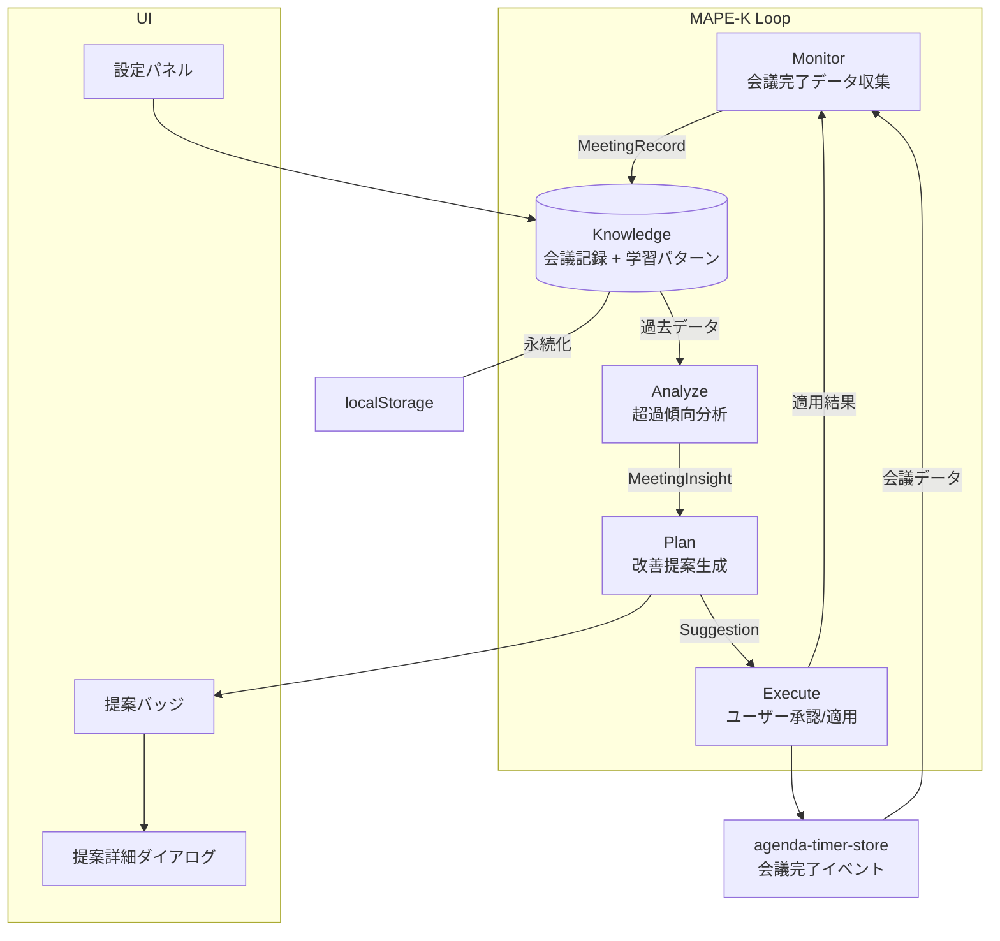
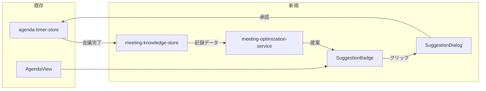
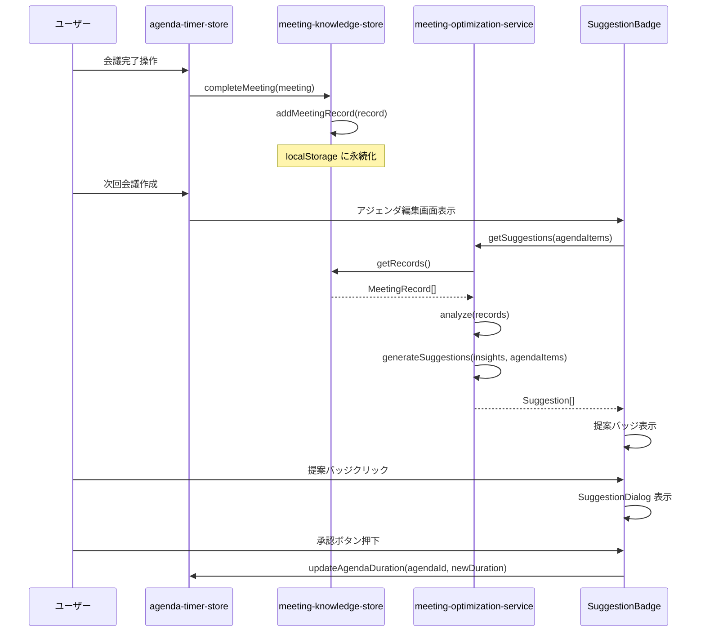

# 設計書: MAPE-K 会議効率化（アジェンダ自律最適化）

## 概要

**目的**: MAPE-K 自律コンピューティングループにより、過去の会議データを蓄積・分析し、アジェンダの予定時間調整と進行改善を自動提案する。
**ユーザー**: 定例会議を運営する主催者が、会議時間の最適化に利用する。
**影響**: `agenda-timer-store` の会議完了イベントを購読し、新規の Knowledge Store + Optimization Service を追加する。既存コンポーネントの変更は最小限。

### ゴール
- 完了した会議データの自動収集と構造的蓄積（Monitor）
- 超過傾向の統計分析とパターン学習（Analyze）
- アジェンダ予定時間の修正提案と推奨時間の算出（Plan）
- ユーザー承認制の提案適用と結果フィードバック（Execute）
- 会議記録・学習パターンの永続化（Knowledge）

### ノンゴール
- 外部 API（AI/クラウド）への依存
- 提案の自動適用（常にユーザー承認が必要）
- リアルタイムの会議中提案（次回会議向けの提案のみ）
- チーム横断分析

## アーキテクチャ

### MAPE-K ループ概観



### コンポーネント統合マップ



### 技術スタック

| レイヤー | 選択 | 役割 |
|---------|------|------|
| UI | React 18 + Radix UI | 提案バッジ・ダイアログ |
| 状態管理 | Zustand 4 (persist) | Knowledge Store（会議記録・学習パターン） |
| 分析エンジン | TypeScript（ローカル計算） | 超過率計算・移動平均・提案生成 |
| データソース | agenda-timer-store | 会議完了イベントの購読 |

## システムフロー

### 会議完了→分析→提案のフロー



## 要件トレーサビリティ

| 要件 | 概要 | コンポーネント | インターフェース |
|------|------|---------------|----------------|
| 1 | Monitor — 会議データ収集 | meeting-knowledge-store | addMeetingRecord |
| 2 | Analyze — 超過傾向分析 | meeting-optimization-service | analyze |
| 3 | Plan — 改善提案生成 | meeting-optimization-service | generateSuggestions |
| 4 | Execute — ユーザー承認/適用 | SuggestionBadge, SuggestionDialog | applySuggestion |
| 5 | Knowledge — 学習データ永続化 | meeting-knowledge-store | persist |

## コンポーネントとインターフェース

| コンポーネント | レイヤー | 責務 | 要件 | 新規/既存 |
|---------------|---------|------|------|----------|
| meeting-knowledge-store | Store | 会議記録・学習パターンの CRUD と永続化 | 1, 5 | 新規 |
| meeting-optimization-service | Service | 分析・提案生成のビジネスロジック | 2, 3 | 新規 |
| SuggestionBadge | UI | アジェンダ項目への提案バッジ表示 | 3, 4 | 新規 |
| SuggestionDialog | UI | 提案詳細の表示・承認/却下 UI | 4 | 新規 |
| OptimizationSettings | UI | MAPE-K 設定パネル | 5 | 新規 |
| agenda-timer-store | Store | 会議完了イベントの発行、予定時間の更新 | 1, 4 | 既存（変更最小） |
| AgendaView | UI | 提案バッジの配置ポイント | 4 | 既存（変更最小） |

### ストア層

#### meeting-knowledge-store（新規）

| 項目 | 詳細 |
|------|------|
| 責務 | MAPE-K の Knowledge コンポーネント。全ての会議記録・学習パターン・設定を管理 |
| 要件 | 1, 5 |

**状態管理**

```typescript
// src/types/meetingOptimization.ts に定義予定

interface MeetingRecord {
  id: string;
  meetingId: string;
  title: string;
  agendaRecords: AgendaRecord[];
  totalPlannedDuration: number;  // 秒
  totalActualDuration: number;   // 秒
  completedAt: string;           // ISO 8601
  suggestionApplied: boolean;    // 提案が適用された会議か
}

interface AgendaRecord {
  agendaId: string;
  title: string;
  plannedDuration: number;       // 秒
  actualDuration: number;        // 秒
  wasOvertime: boolean;
  overtimeAmount: number;        // 秒（超過量、0 以上）
}

interface LearnedPattern {
  id: string;
  titlePattern: string;          // 議題タイトルの分類パターン
  avgPlannedDuration: number;    // 秒
  avgActualDuration: number;     // 秒
  avgOvertimeRate: number;       // 0-1
  sampleCount: number;           // 集計対象件数
  updatedAt: string;
}

interface KnowledgeSettings {
  enabled: boolean;              // 提案表示 ON/OFF
  learningWindow: number;        // 学習期間（件数、デフォルト 20）
  movingAverageWindow: number;   // 移動平均ウィンドウ（デフォルト 5）
  suggestionThreshold: number;   // 提案生成の超過率閾値（デフォルト 0.2）
}

interface MeetingKnowledgeState {
  records: MeetingRecord[];
  learnedPatterns: LearnedPattern[];
  settings: KnowledgeSettings;
}

interface MeetingKnowledgeActions {
  addMeetingRecord: (meeting: Meeting) => void;
  getRecords: () => MeetingRecord[];
  getPatterns: () => LearnedPattern[];
  updateSettings: (settings: Partial<KnowledgeSettings>) => void;
  resetKnowledge: () => void;
}
```

- 永続化: `zustand/persist` で localStorage に保存
- 最大 100 件保持。超過時は `completedAt` が最も古いレコードを削除
- `partialize`: `records`, `learnedPatterns`, `settings` のみ永続化

### サービス層

#### meeting-optimization-service（新規）

| 項目 | 詳細 |
|------|------|
| 責務 | MAPE-K の Analyze + Plan コンポーネント。分析と提案生成のロジック |
| 要件 | 2, 3 |

**インターフェース**

```typescript
interface MeetingInsight {
  type: 'overtime-trend' | 'item-pattern' | 'duration-mismatch';
  description: string;
  confidence: number;            // 0-1
  data: Record<string, number>;
}

interface Suggestion {
  id: string;
  agendaId: string;
  type: 'duration-adjustment' | 'total-duration' | 'notification-timing';
  currentValue: number;          // 秒
  suggestedValue: number;        // 秒
  reason: string;                // 人間可読な根拠
  confidence: number;            // 0-1
  basedOnCount: number;          // 根拠データ件数
}

// 公開 API
function analyze(records: MeetingRecord[]): MeetingInsight[];
function generateSuggestions(
  insights: MeetingInsight[],
  agendaItems: AgendaItem[],
  patterns: LearnedPattern[],
): Suggestion[];
function getSuggestionsForAgenda(agendaItems: AgendaItem[]): Suggestion[];
```

**分析ロジック**:
1. **超過率計算**: `(actualDuration - plannedDuration) / plannedDuration` を項目ごとに算出
2. **移動平均**: 直近 N 件（デフォルト 5）の会議全体超過率の移動平均
3. **パターンマッチング**: 議題タイトルを正規化し、類似パターンをグルーピング
4. **提案生成条件**: 平均超過率が `suggestionThreshold`（デフォルト 20%）以上の場合

**提案生成ロジック**:
- `suggestedValue = avgActualDuration * 1.1`（実績の 110% をバッファとして推奨）
- `confidence = min(1, sampleCount / learningWindow)`（データ量に応じた信頼度）
- 最低 3 件のデータがないと提案を生成しない

### UI 層

#### SuggestionBadge（新規）

| 項目 | 詳細 |
|------|------|
| 責務 | アジェンダ項目横に提案の有無を示すバッジを表示 |
| 要件 | 3, 4 |

- props: `suggestion: Suggestion | null`
- 提案がある場合: オレンジ色のバッジ + ツールチップで概要表示
- クリックで SuggestionDialog を開く

#### SuggestionDialog（新規）

| 項目 | 詳細 |
|------|------|
| 責務 | 提案の詳細表示と承認/却下の操作 |
| 要件 | 4 |

- Radix UI Dialog を使用
- 表示内容: 現在値 → 提案値、根拠説明、信頼度、データ件数
- 操作: 「適用」ボタン → `agenda-timer-store.updateAgendaDuration()`
- 操作: 「却下」ボタン → フィードバック記録

## データモデル

### ドメインモデル

```mermaid
erDiagram
  MeetingKnowledgeStore ||--o{ MeetingRecord : "stores"
  MeetingKnowledgeStore ||--o{ LearnedPattern : "maintains"
  MeetingKnowledgeStore ||--|| KnowledgeSettings : "configured by"
  MeetingRecord ||--o{ AgendaRecord : "contains"
  MeetingRecord {
    string id
    string meetingId
    string title
    number totalPlannedDuration
    number totalActualDuration
    string completedAt
    boolean suggestionApplied
  }
  AgendaRecord {
    string agendaId
    string title
    number plannedDuration
    number actualDuration
    boolean wasOvertime
    number overtimeAmount
  }
  LearnedPattern {
    string id
    string titlePattern
    number avgPlannedDuration
    number avgActualDuration
    number avgOvertimeRate
    number sampleCount
  }
  MeetingOptimizationService ..> MeetingRecord : "analyzes"
  MeetingOptimizationService ..> LearnedPattern : "references"
  MeetingOptimizationService ..> MeetingInsight : "produces"
  MeetingOptimizationService ..> Suggestion : "generates"
```

### 物理データモデル

**localStorage キー**: `meeting-knowledge-store`

```json
{
  "state": {
    "records": [ /* MeetingRecord[] — 最大 100 件 */ ],
    "learnedPatterns": [ /* LearnedPattern[] */ ],
    "settings": {
      "enabled": true,
      "learningWindow": 20,
      "movingAverageWindow": 5,
      "suggestionThreshold": 0.2
    }
  },
  "version": 0
}
```

## エラーハンドリング

### エラーカテゴリ

| エラー | 対応 |
|--------|------|
| 会議記録データ不整合 | バリデーション失敗をログ記録、記録をスキップ |
| localStorage 容量超過 | 古いレコードから自動削除して再保存 |
| 分析データ不足（3 件未満） | 「データ収集中」UI を表示、提案なし |
| パターンマッチング失敗 | パターンなしとして新規パターンを生成 |

### 監視

- 会議記録の追加/削除を `logger.ts` 経由で記録
- 提案の生成/承認/却下を `logger.ts` 経由で記録

## テスト戦略

### ユニットテスト
- `meeting-optimization-service`: 超過率計算、移動平均、提案生成ロジック
- `meeting-knowledge-store`: CRUD 操作、100 件制限、リセット
- エッジケース: 0 件データ、全議題超過なし、全議題超過

### 統合テスト
- 会議完了 → Monitor → Knowledge 自動記録
- 提案表示 → 承認 → 予定時間更新のフロー
- 設定変更 → 提案閾値反映

### パフォーマンステスト
- 100 件の会議記録に対する分析・提案生成の応答速度
