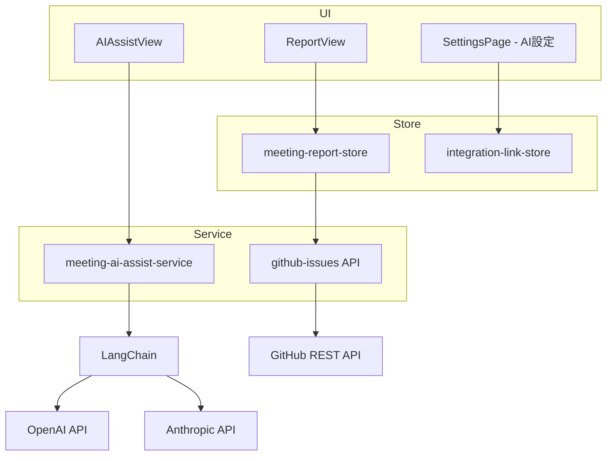
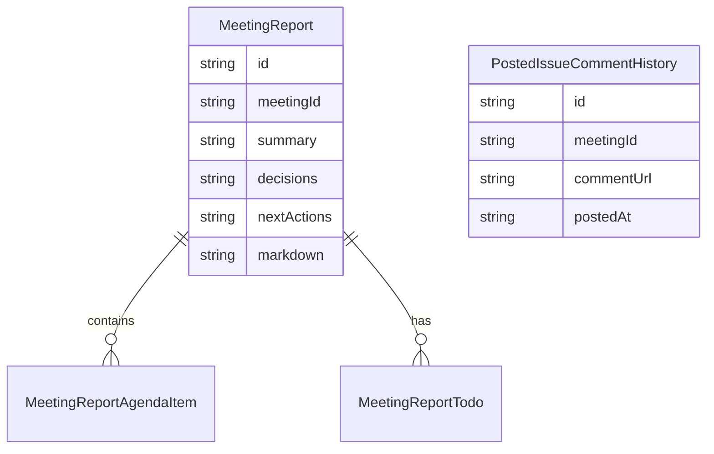

# 設計書: 会議レポート

## 概要

**目的**: 会議結果からドラフトレポートを自動生成し、AI アシストによるファシリテーション支援と GitHub Issue 連携を提供する。
**ユーザー**: 会議主催者が、レポート作成の省力化と会議品質の向上に利用する。

### ゴール
- 会議結果からのドラフトレポート自動生成（サマリー/決定事項/ToDo/次回アクション）
- AI アシスト提案（5 種類）の表示と採用可否判断
- AI API 設定（プロバイダー/モデル/API キー/temperature/接続テスト）
- GitHub Issue コメントへのレポート投稿
- Markdown 形式での保存

### ノンゴール
- PDF/Word エクスポート
- 複数フォーマットの同時保存

## アーキテクチャ

### アーキテクチャパターン



### 技術スタック

| レイヤー | 選択 | 役割 |
|---------|------|------|
| UI | React 18 + Radix UI | レポート編集・AI 提案表示 |
| 状態管理 | Zustand 4 (persist) | レポート・投稿履歴管理 |
| AI | LangChain (OpenAI / Anthropic) | ファシリテーション AI |
| 外部 API | GitHub REST API | Issue コメント投稿 |

## 要件トレーサビリティ

| 要件 | 概要 | コンポーネント |
|------|------|---------------|
| 1 | ドラフトレポート生成 | meeting-report-store |
| 2 | AI アシスト提案 | meeting-ai-assist-service |
| 3 | AI API 設定 | integration-link-store, SettingsPage |
| 4 | GitHub Issue コメント投稿 | github-issues API, meeting-report-store |

## コンポーネントとインターフェース

| コンポーネント | レイヤー | 責務 | 要件 |
|---------------|---------|------|------|
| ReportView | UI | レポート表示・編集・保存 | 1, 4 |
| AIAssistView | UI | AI 提案の表示・採用 | 2 |
| SettingsPage | UI | AI API 設定 UI | 3 |
| meeting-report-store | Store | レポート CRUD・Markdown 生成 | 1, 4 |
| integration-link-store | Store | PAT/AI 設定メモリ保持 | 3, 4 |
| meeting-ai-assist-service | Service | LangChain 統合・フォールバック | 2 |
| github-issues API | API | Issue コメント投稿 | 4 |

### サービス層

#### meeting-ai-assist-service

| 項目 | 詳細 |
|------|------|
| 責務 | 5 種類の AI アシスト提案生成、ルールベースフォールバック |
| 要件 | 2 |

**インターフェース**

```typescript
// AI アシスト提案の種類
type AssistType = 'summary' | 'consensus' | 'facilitation' | 'nextAgenda' | 'preparation';

interface AIAssistResult {
  type: AssistType;
  content: string;
  confidence: number;
}
```

- LangChain 経由で OpenAI / Anthropic を切替
- API 未設定・失敗時はルールベース提案へフォールバック
- API キーはメモリ保持のみ（永続化禁止）

## データモデル



- 型は `src/types/meetingReport.ts` に定義済み

## エラーハンドリング

- AI API 失敗: ルールベースフォールバック + エラートースト
- GitHub 投稿失敗: 失敗通知を表示、レポートデータは保持
- API キー未設定: AI アシストセクションを非アクティブ表示

## テスト戦略

- ユニットテスト: レポート生成ロジック、Markdown 変換、フォールバック判定
- 統合テスト: 会議完了→レポート生成→編集→保存のフロー
- モックテスト: AI API / GitHub API のモックによるエラーハンドリング検証
