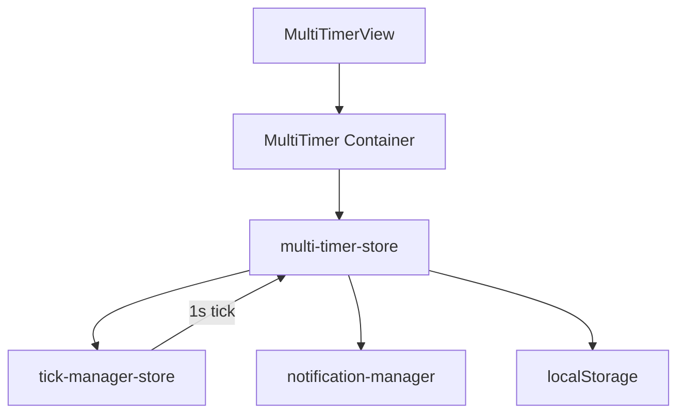
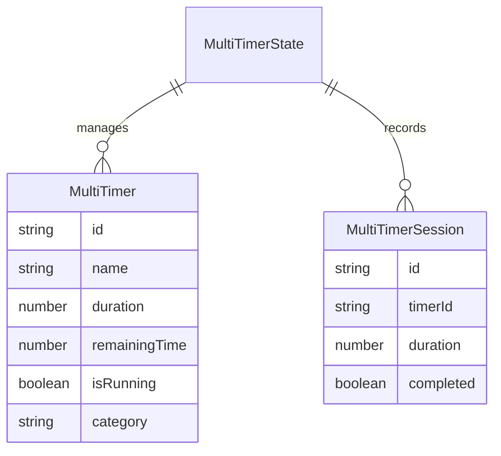

# 設計書: 複数タイマー

## 概要

**目的**: 複数のカウントダウンタイマーを同時に管理し、並行タスクの時間追跡を可能にする。
**ユーザー**: 複数タスクを並行管理する個人が、各タスクの時間配分を追跡するために利用する。

### ゴール
- タイマーの追加・複製・削除・カテゴリ管理
- 個別操作と一括操作（全開始/全停止）
- 完了時通知

### ノンゴール
- タイマー間の依存関係設定
- チーム共有タイマー

## アーキテクチャ

### アーキテクチャパターン



### 技術スタック

| レイヤー | 選択 | 役割 |
|---------|------|------|
| UI | React 18 + Radix UI | タイマーリスト・操作ボタン |
| 状態管理 | Zustand 4 (persist) | タイマーインスタンス管理 |
| ティック | tick-manager-store | 1 秒間隔 tick（複数タイマーを一括更新） |
| 通知 | notification-manager | 完了通知 |

## コンポーネントとインターフェース

| コンポーネント | レイヤー | 責務 | 要件 |
|---------------|---------|------|------|
| MultiTimerView | UI | タイマーリスト・操作 UI | 1, 2, 3 |
| MultiTimer | Container | ストア配線 | 1, 2, 3 |
| multi-timer-store | Store | インスタンス管理・一括操作 | 1, 2, 3 |

### ストア層

#### multi-timer-store

| 項目 | 詳細 |
|------|------|
| 責務 | 複数タイマーの CRUD・個別/一括操作・カテゴリ管理 |
| 要件 | 1, 2, 3 |

**状態管理**

```typescript
// src/types/multi-timer.ts に定義済み
interface MultiTimerState {
  timers: MultiTimer[];
  sessions: MultiTimerSession[];
  isAnyRunning: boolean;
  categories: string[];
  globalSettings: {
    autoStartNext: boolean;
    showNotifications: boolean;
    soundEnabled: boolean;
  };
}
```

- パーインスタンス状態: 各 `MultiTimer` が独立した `isRunning` / `remainingTime` を保持
- 一括操作: `startAll()` / `stopAll()` で全タイマーを一斉制御
- tick: 実行中の全タイマーに対して `remainingTime -= 1` を適用

## データモデル



## エラーハンドリング

- タイマー名未入力: バリデーションで追加を拒否
- 重複カテゴリ: 既存カテゴリを再利用

## テスト戦略

- ユニットテスト: CRUD 操作、一括開始/停止、tick による残時間更新
- 統合テスト: タイマー追加→開始→完了→通知の E2E フロー
