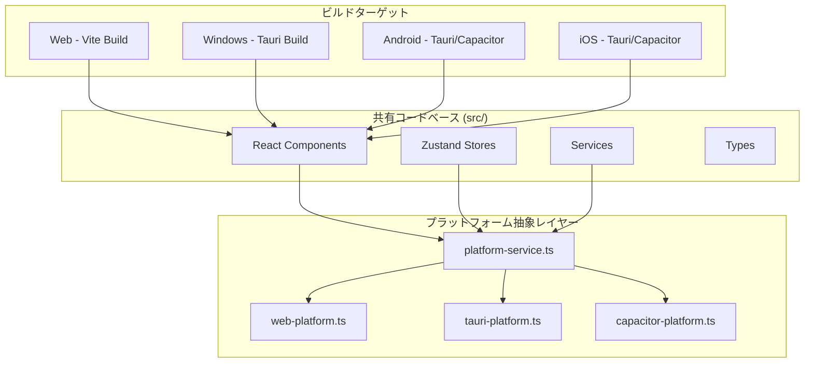

# 設計書: モバイルアプリ・Windows アプリケーション化

## 概要

**目的**: Focuso の既存 React コードベースを再利用し、Windows デスクトップアプリおよびモバイルアプリ（Android / iOS）として配布可能にする。
**ユーザー**: 既存の Focuso ウェブ版ユーザー、およびネイティブアプリを求める新規ユーザー。
**影響**: ビルドパイプラインの拡張、プラットフォーム固有 API の抽象化レイヤー追加。既存のウェブ版には影響しない。

### ゴール
- Windows デスクトップアプリとして `.exe` / `.msi` インストーラーで配布可能にする
- Android / iOS ネイティブアプリとしてアプリストアへ配布可能にする
- 既存の React / TypeScript コードベースを最大限共有する（目標: 95% 以上のコード共有率）
- OS ネイティブ通知・バックグラウンド動作を実現する

### ノンゴール
- React Native への書き換え（既存コードの破棄を伴うため）
- クラウド同期の実装（将来フェーズで検討）
- macOS / Linux 版のリリース（アーキテクチャ上はサポート可能だが、初期スコープ外）

---

## 技術選定: 候補比較

### デスクトップ向け

| 項目 | Tauri 2.x | Electron | PWA |
|------|-----------|----------|-----|
| バイナリサイズ | 小（約 3–10 MB） | 大（約 150 MB+） | N/A（インストール不要） |
| メモリ使用量 | 少（OS WebView 利用） | 多（Chromium 同梱） | ブラウザ依存 |
| OS WebView | Windows: WebView2 (Edge) | 内蔵 Chromium | ブラウザ |
| バックエンド言語 | Rust | Node.js | なし |
| 自動アップデート | 内蔵 | electron-updater | ブラウザ任せ |
| システムトレイ | ✅ | ✅ | ❌ |
| ネイティブ通知 | ✅ | ✅ | ⚠️ 制限あり |
| Vite 統合 | ✅（公式プラグイン） | ✅（electron-vite） | N/A |
| セキュリティ | 高（Rust + IPC 許可制） | 中（Node.js フル権限） | 高（サンドボックス） |
| 学習コスト | 中（Rust は不慣れな場合） | 低（Node.js） | 最低 |

### モバイル向け

| 項目 | Tauri 2.x Mobile | Capacitor | React Native | PWA |
|------|-------------------|-----------|--------------|-----|
| コード共有率 | 95%+（同一 Web コード） | 95%+（同一 Web コード） | 30–50%（書き換え必要） | 100% |
| ネイティブ API | Rust プラグイン | Cordova/Capacitor プラグイン | React Native モジュール | 制限あり |
| バックグラウンド実行 | ⚠️ プラグイン経由 | ⚠️ プラグイン経由 | ✅ ネイティブ | ❌ |
| プッシュ通知 | ✅ プラグイン | ✅ プラグイン | ✅ ネイティブ | ⚠️ 制限あり |
| アプリストア配布 | ✅ | ✅ | ✅ | ⚠️ 限定 |
| 成熟度 | 低（2.x で正式追加） | 高（Ionic 提供） | 最高 | 高 |
| Vite 統合 | ✅ 公式サポート | ✅ 公式サポート | ❌ Metro Bundler | N/A |

### 推奨アプローチ

**フェーズ 1（短期）: PWA 化**
- 最小工数でモバイル・デスクトップの両方でインストール可能にする
- Service Worker によるオフライン動作を確保する
- 既存コードへの影響を最小化する

**フェーズ 2（中期）: Tauri 2.x によるデスクトップアプリ化**
- Windows 向けネイティブアプリとして配布する
- システムトレイ常駐・OS 通知・自動アップデートを実現する
- Rust バックエンドは最小限に留め、フロントエンドの React コードをそのまま利用する

**フェーズ 3（長期）: Tauri 2.x Mobile または Capacitor によるモバイルアプリ化**
- Tauri 2.x Mobile が安定していれば統一プラットフォームとして採用する
- Tauri Mobile の成熟度が不十分な場合、Capacitor を代替として採用する

### 選定理由

1. **Tauri を推奨する理由**:
   - Vite との公式統合があり、既存ビルドシステムとの親和性が高い
   - バイナリサイズが小さく（3–10 MB vs Electron の 150 MB+）、配布しやすい
   - Rust ベースのセキュリティモデルが堅牢で、IPC 許可制で不要な権限を排除できる
   - デスクトップとモバイルを単一フレームワークでカバーする将来性がある

2. **Electron を採用しない理由**:
   - バンドルサイズが大きく（Chromium 同梱）、ユーザー体験に影響する
   - Node.js バックエンドにフルアクセス権限があり、セキュリティリスクが相対的に高い

3. **React Native を採用しない理由**:
   - 既存の React DOM + CSS コードをほぼ全面的に書き換える必要がある
   - Radix UI / Tailwind CSS / shadcn/ui が React Native では使用不可
   - コード共有率が 30–50% に低下し、開発・保守コストが倍増する

---

## アーキテクチャ

### 全体構成



### プラットフォーム抽象レイヤー設計

既存コードがプラットフォーム固有 API に直接依存しないよう、抽象レイヤーを挿入する。

```typescript
// src/services/platform/platform-service.ts
interface PlatformService {
  /** プラットフォーム種別 */
  readonly type: 'web' | 'tauri' | 'capacitor';

  /** 通知を送信する */
  sendNotification(title: string, body: string): Promise<void>;

  /** データを永続化する */
  persistData(key: string, value: string): Promise<void>;

  /** 永続化データを読み取る */
  readData(key: string): Promise<string | null>;

  /** アプリをバックグラウンドに最小化する（デスクトップ: トレイ化） */
  minimizeToBackground(): Promise<void>;

  /** バックグラウンドタスクを登録する */
  registerBackgroundTask(taskId: string, callback: () => void): Promise<void>;
}
```

```typescript
// src/services/platform/web-platform.ts
class WebPlatformService implements PlatformService {
  readonly type = 'web';

  async sendNotification(title: string, body: string): Promise<void> {
    // 既存の notification-manager.ts を利用
  }

  async persistData(key: string, value: string): Promise<void> {
    localStorage.setItem(key, value);
  }

  async readData(key: string): Promise<string | null> {
    return localStorage.getItem(key);
  }

  // ...
}
```

```typescript
// src/services/platform/tauri-platform.ts
class TauriPlatformService implements PlatformService {
  readonly type = 'tauri';

  async sendNotification(title: string, body: string): Promise<void> {
    // @tauri-apps/plugin-notification を利用
    const { sendNotification } = await import('@tauri-apps/plugin-notification');
    sendNotification({ title, body });
  }

  async persistData(key: string, value: string): Promise<void> {
    // @tauri-apps/plugin-store を利用
    const { Store } = await import('@tauri-apps/plugin-store');
    const store = await Store.load('focuso-data.json');
    await store.set(key, value);
    await store.save();
  }

  // ...
}
```

### ディレクトリ構成（変更点のみ）

```
src/
├── services/
│   └── platform/                    # 新規: プラットフォーム抽象レイヤー
│       ├── platform-service.ts      # interface 定義
│       ├── web-platform.ts          # ウェブ実装（既存ロジック委譲）
│       ├── tauri-platform.ts        # Tauri 実装
│       ├── capacitor-platform.ts    # Capacitor 実装（将来）
│       └── index.ts                 # プラットフォーム自動検出・エクスポート
├── ...（既存構成に変更なし）

src-tauri/                           # 新規: Tauri バックエンド（Rust）
├── Cargo.toml
├── tauri.conf.json                  # Tauri 設定
├── src/
│   └── main.rs                      # Rust エントリポイント
├── icons/                           # アプリアイコン
└── capabilities/                    # 権限設定

public/
├── manifest.json                    # 新規: PWA マニフェスト
├── sw.js                            # 新規: Service Worker
└── ...（既存ファイル）
```

### Tauri 設定（Windows デスクトップ）

```json
// src-tauri/tauri.conf.json（概要）
{
  "productName": "Focuso",
  "version": "1.0.0",
  "identifier": "com.focuso.app",
  "build": {
    "frontendDist": "../dist",
    "devUrl": "http://localhost:3000"
  },
  "app": {
    "windows": [
      {
        "title": "Focuso",
        "width": 1200,
        "height": 800,
        "minWidth": 800,
        "minHeight": 600
      }
    ],
    "trayIcon": {
      "iconPath": "icons/icon.png",
      "tooltip": "Focuso - Timer App"
    }
  },
  "bundle": {
    "active": true,
    "targets": ["msi", "nsis"],
    "icon": ["icons/icon.ico"],
    "windows": {
      "certificateThumbprint": null,
      "digestAlgorithm": "sha256"
    }
  },
  "plugins": {
    "notification": { "all": true },
    "store": {},
    "updater": {
      "endpoints": ["<PLACEHOLDER: 実装時に GitHub Releases URL または自前サーバー URL を設定>"],
      "dialog": true,
      "pubkey": "<PLACEHOLDER: 実装時に `tauri signer generate` で生成した公開鍵を設定>"
    }
  }
}
```

### PWA 設定

```json
// public/manifest.json
{
  "name": "Focuso",
  "short_name": "Focuso",
  "description": "業務効率化タイマーアプリ",
  "start_url": "/",
  "display": "standalone",
  "background_color": "#09090b",
  "theme_color": "#f97316",
  "orientation": "any",
  "icons": [
    { "src": "/icons/icon-192.png", "sizes": "192x192", "type": "image/png" },
    { "src": "/icons/icon-512.png", "sizes": "512x512", "type": "image/png" }
  ]
}
```

---

## 要件トレーサビリティ

| 要件 | 概要 | コンポーネント | フェーズ |
|------|------|---------------|---------|
| 1 | Windows デスクトップアプリ | Tauri, src-tauri/, platform-service | 2 |
| 2 | モバイルアプリ | Tauri Mobile / Capacitor, platform-service | 3 |
| 3 | コードベース共有 | platform-service 抽象レイヤー | 1–3 |
| 4 | データ永続化 | platform-service.persistData/readData | 1–3 |
| 5 | 自動アップデート | Tauri updater / App Store | 2–3 |

---

## コンポーネントとインターフェース

| コンポーネント | レイヤー | 責務 | 要件 |
|---------------|---------|------|------|
| PlatformService | Service | プラットフォーム API 抽象化 | 1, 2, 3 |
| WebPlatformService | Service | ウェブ版 API 実装 | 3 |
| TauriPlatformService | Service | Tauri ネイティブ API 実装 | 1, 2 |
| src-tauri/main.rs | Backend | Rust バックエンド（Tauri） | 1 |
| manifest.json + sw.js | Config | PWA マニフェスト・Service Worker | 1, 2 |
| tauri.conf.json | Config | Tauri アプリ設定 | 1 |
| CI/CD Workflows | DevOps | プラットフォーム別ビルド・リリース | 3, 5 |

---

## 既存コードへの影響分析

### 変更が必要なファイル

| ファイル | 変更内容 | 影響度 |
|---------|----------|-------|
| `src/utils/notification-manager.ts` | PlatformService 経由に切り替え（既存 API は WebPlatformService に委譲） | 中 |
| `package.json` | Tauri CLI・PWA プラグイン追加 | 低 |
| `vite.config.ts` | PWA プラグイン追加、Tauri dev 設定 | 低 |
| `index.html` | PWA manifest リンク追加 | 低 |

### 変更不要なファイル

| ファイル/ディレクトリ | 理由 |
|---------------------|------|
| `src/features/timer/stores/*` | Zustand ストアは localStorage 経由で永続化しており、PlatformService 移行後もインターフェースは不変 |
| `src/features/timer/components/*` | React コンポーネントはプラットフォーム非依存 |
| `src/types/*` | ドメイン型はプラットフォーム非依存 |

---

## CI/CD パイプライン設計

### ビルドマトリクス

```yaml
# .github/workflows/build-native.yml（概要）
jobs:
  build-web:
    runs-on: ubuntu-latest
    steps: [npm install, npm run build, deploy to GitHub Pages]

  build-windows:
    runs-on: windows-latest
    steps: [npm install, install Rust, npm run tauri build]
    artifacts: [*.msi, *.exe]

  build-android:
    runs-on: ubuntu-latest
    steps: [npm install, install Android SDK, npm run tauri android build]
    artifacts: [*.apk, *.aab]

  build-ios:
    runs-on: macos-latest
    steps: [npm install, npm run tauri ios build]
    artifacts: [*.ipa]
```

---

## セキュリティ考慮

- Tauri の IPC 許可制（Capability ベース）により、フロントエンドからアクセスできるネイティブ API を最小限に制限する
- API キーは引き続きメモリ保持のみ（永続化禁止）
- CSP ヘッダーはプラットフォーム別に適切に設定する
- 自動アップデートは署名検証を必須とする

---

## リスクと緩和策

| リスク | 影響 | 緩和策 |
|-------|------|-------|
| Tauri 2.x Mobile がまだ成熟していない | モバイル版のリリース遅延 | Capacitor を代替パスとして維持 |
| WebView2 が古い Windows で未対応 | Windows 10 1803 以前で動作しない | インストーラーに WebView2 bootstrapper を同梱 |
| Rust 学習コスト | 開発速度低下 | Rust バックエンドは最小限に留め、ほぼフロントエンド完結とする |
| アプリストア審査 | リリースまでのリードタイム | 審査要件を事前調査し、初回は PWA で配布 |
| バックグラウンドタイマー精度 | モバイルで OS がプロセスを停止 | ネイティブバックグラウンドタスク API + 復帰時の時刻補正（既存の lastTickTime 補正を活用） |

---

## テスト戦略

- **ユニットテスト**: PlatformService の各実装を Mock でテスト
- **統合テスト**: Tauri の `tauri-driver` による E2E テスト（WebDriver 互換）
- **手動テスト**: 各プラットフォームでのスモークテスト（起動・タイマー動作・通知・オフライン）
- **既存テスト**: 現行の Vitest テストスイートは変更なしで通過することを確認する

---

## マイルストーン

| フェーズ | 期間目安 | 成果物 |
|---------|---------|--------|
| 1: PWA 化 | 1–2 週間 | manifest.json, Service Worker, オフライン対応 |
| 2: Windows デスクトップ | 2–4 週間 | Tauri 統合, .msi インストーラー, トレイ常駐, OS 通知 |
| 3: モバイル（Android 優先） | 3–6 週間 | APK ビルド, プッシュ通知, バックグラウンドタイマー |
| 4: モバイル（iOS） | 2–4 週間 | IPA ビルド, App Store 申請 |
