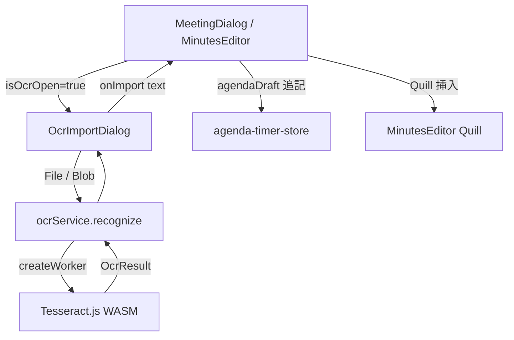

# 設計書: 画像 OCR テキスト入力機能

## 概要

**目的**: ホワイトボード板書・アジェンダ資料の写真からテキストを認識し、アジェンダ下書きまたは議事録に取り込む。  
**ユーザー**: 会議前に板書・資料写真からアジェンダを準備するユーザー、議事録にホワイトボード内容を取り込むユーザー。  
**影響**: `MeetingDialog`（アジェンダ下書き）と `MinutesEditor`（議事録エディタ）に OCR 機能を追加。

### ゴール
- バックエンドサーバー不要のブラウザ内 OCR（Tesseract.js WASM）
- 日本語横書き・縦書き・英語の認識言語選択
- 認識結果を確認・編集してから取り込み（自動反映なし）

### ノンゴール
- 画像前処理（グレースケール・コントラスト強調）— 将来拡張
- NDL OCR-Lite / Google Cloud Vision API との直接統合 — 将来拡張
- 複数画像のバッチ処理 — 将来拡張

## アーキテクチャ

### アーキテクチャパターン



**選択パターン**: サービス層 (`ocr-service.ts`) + UI ダイアログ (`OcrImportDialog`) の分離

### 技術スタック

| レイヤー | 選択 | 役割 |
|---------|------|------|
| OCR エンジン | Tesseract.js 7 (WASM) | ブラウザ内文字認識（jpn / jpn_vert / eng） |
| UI | React 18 + Radix UI Dialog | 画像入力・進捗・結果編集ダイアログ |
| 型定義 | `src/types/ocr.ts` | OcrLanguage / OcrOptions / OcrResult / OcrImportMode |
| ログ | `src/utils/logger.ts` | OCR 開始/完了/失敗のログ記録 |

### 技術選定: OCR ライブラリ比較

| ライブラリ | 方式 | 日本語精度 | バックエンド不要 | 採用判定 |
|-----------|------|-----------|----------------|---------|
| **Tesseract.js** | ブラウザ WASM | ★★★☆ | ✅ | ✅ **採用** |
| NDL OCR-Lite | Python サーバー | ★★★★★ | ❌ | 将来オプション |
| Google Cloud Vision | クラウド API | ★★★★★ | ❌ | 将来オプション |

### ファイル構成

```
src/
├── types/
│   └── ocr.ts                          # OcrLanguage / OcrOptions / OcrResult / OcrImportMode
├── features/timer/
│   ├── services/
│   │   └── ocr-service.ts              # Tesseract.js ラッパー（OcrService クラス）
│   └── components/agenda/
│       ├── OcrImportDialog.tsx         # 画像入力 + OCR + 結果編集ダイアログ
│       ├── MeetingDialog.tsx           # 「画像から読み込む」ボタン追加
│       └── MinutesEditor.tsx           # カメラアイコンボタン追加
```

## コンポーネント設計

### `OcrImportDialog`

| プロパティ | 型 | 説明 |
|----------|-----|------|
| `isOpen` | `boolean` | ダイアログ表示フラグ |
| `mode` | `'agenda' \| 'minutes'` | 使用コンテキスト（ボタンラベルの切り替え） |
| `onClose` | `() => void` | 閉じる時のコールバック |
| `onImport` | `(text: string) => void` | 確定テキストを呼び出し元に渡すコールバック |

**UI フロー**:

```
[画像未選択] ドラッグ&ドロップ / ファイル選択 / カメラ撮影
    ↓
[画像プレビュー + 言語選択]
    ↓ 「文字を認識する」ボタン
[OCR 実行中] プログレスバー表示
    ↓
[認識結果テキストエリア（編集可）]
    ↓ 「アジェンダ下書きに反映」または「議事録に挿入」
[呼び出し元へ onImport(text) → ダイアログを閉じる]
```

### `ocrService`

```typescript
class OcrService {
  async recognize(image: File | Blob, options?: OcrOptions): Promise<OcrResult>
}
export const ocrService: OcrService;
```

- `createWorker(language)` で Tesseract ワーカーを生成
- `logger (status === 'recognizing text')` イベントで進捗を `onProgress` に通知
- 認識後は必ず `worker.terminate()` を呼び出す（`finally` ブロック）
- 開始・完了・失敗を `logger.ts` に記録

### データフロー: アジェンダ下書き

```
MeetingDialog
  └─ 「画像から読み込む」ボタン → isOcrOpen=true
       └─ OcrImportDialog(mode="agenda")
            └─ onImport(text) → setAgendaDraft(prev => prev ? prev + "\n" + text : text)
```

### データフロー: 議事録挿入

```
MinutesEditor
  └─ カメラアイコンボタン → isOcrOpen=true
       └─ OcrImportDialog(mode="minutes")
            └─ onImport(text)
                 ├─ [Quill 初期化済み] quillRef.current.insertText(index, "\n" + text)
                 └─ [Quill 未初期化] setMinutesContent(prev => prev + "\n" + text)
```

## 要件トレーサビリティ

| 要件 | 概要 | コンポーネント |
|------|------|---------------|
| 1 | 画像入力 | OcrImportDialog（ファイル/ドロップ/カメラ） |
| 2 | OCR 実行 | ocrService, OcrImportDialog（進捗バー） |
| 3 | テキスト確認・編集 | OcrImportDialog（Textarea + クリアボタン） |
| 4 | アジェンダ下書きへの取り込み | MeetingDialog, OcrImportDialog(mode="agenda") |
| 5 | 議事録への挿入 | MinutesEditor, OcrImportDialog(mode="minutes") |
| 6 | プライバシー・セキュリティ | ocrService（ブラウザ内処理、worker.terminate） |

## 制約・注意事項

### 認識精度

| 対象 | 精度 | 備考 |
|------|------|------|
| 印刷物（横書き） | ★★★★ | Tesseract.js が得意 |
| 印刷物（縦書き） | ★★★ | `jpn_vert` モードで改善 |
| ホワイトボード手書き | ★★ | 高精度が必要なら NDL OCR-Lite / Google Vision 推奨 |
| スキャン品質が低い画像 | ★ | 前処理なしでは困難 |

### パフォーマンス

- 初回実行時に言語データ（`jpn`: 約 8 MB）を CDN からダウンロード（以降はキャッシュ）
- 認識処理時間: 画像サイズに依存、通常 5–30 秒
- 同時 OCR は行わない（逐次処理）

## 将来の拡張ポイント

1. **NDL OCR-Lite サーバー連携**: 設定画面に OCR サーバー URL を追加し、`ocrService` でリモート API を呼び出す（FastAPI ラッパー）
2. **Google Cloud Vision API**: `integration-link-store` を拡張して Google Vision API キーを登録
3. **画像前処理**: グレースケール化・コントラスト強調で手書き認識精度を向上
4. **バッチ処理**: 複数画像を連続処理してアジェンダリストを生成

詳細: `docs/DESIGN_OCR_IMAGE_INPUT.md` 参照
