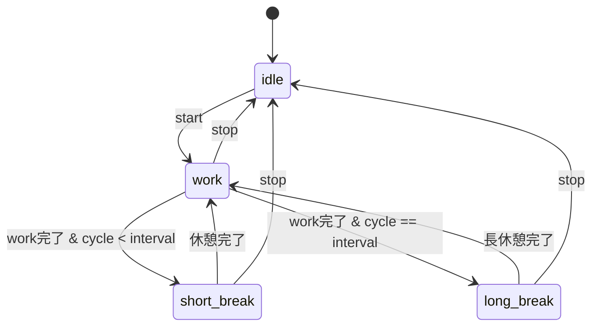
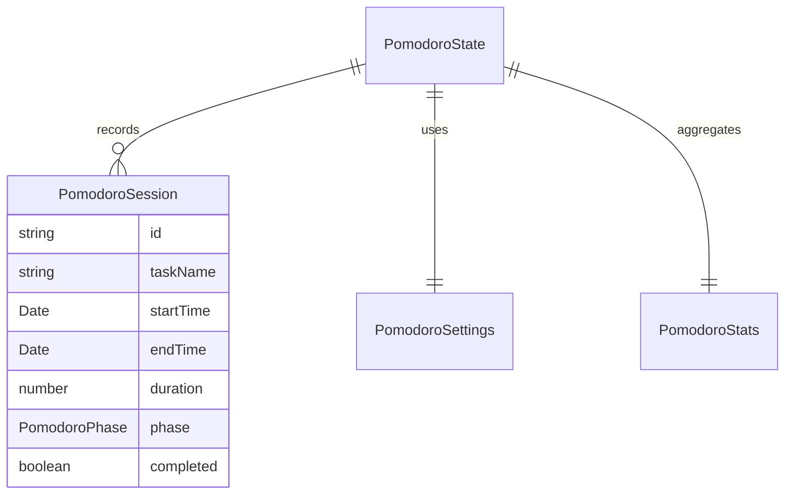

# 設計書: ポモドーロ

## 概要

**目的**: ポモドーロ・テクニックに基づく作業/休憩のフェーズ自動切替を提供し、1 日の集中リズムを最適化する。
**ユーザー**: 集中作業を行う個人が、作業と休憩のバランスを自動管理するために利用する。
**影響**: 基本タイマーと共通の tick 基盤を共有し、分析ダッシュボードにデータを供給する。

### ゴール
- 作業/短休憩/長休憩の自動フェーズ遷移
- カスタマイズ可能な時間設定と自動開始設定
- 1 日統計のリアルタイム集計

### ノンゴール
- 複数ポモドーロの並行実行
- チーム共有ポモドーロ

## アーキテクチャ

### アーキテクチャパターン



**選択パターン**: 状態機械 + Zustand store

### 技術スタック

| レイヤー | 選択 | 役割 |
|---------|------|------|
| UI | React 18 + Radix UI | フェーズ表示・操作・設定 |
| 状態管理 | Zustand 4 (persist) | フェーズ/設定/統計の管理 |
| ティック | tick-manager-store | 1 秒間隔 tick |
| 通知 | notification-manager | フェーズ完了通知 |

## 要件トレーサビリティ

| 要件 | 概要 | コンポーネント |
|------|------|---------------|
| 1 | フェーズ管理 | pomodoro-store, EnhancedPomodoroTimer |
| 2 | 自動開始設定 | pomodoro-store |
| 3 | 1 日統計 | pomodoro-store, ダッシュボード |

## コンポーネントとインターフェース

| コンポーネント | レイヤー | 責務 | 要件 |
|---------------|---------|------|------|
| PomodoroView | UI | フェーズ表示・操作 UI | 1, 2 |
| EnhancedPomodoroTimer | Container | ストア配線 | 1, 2, 3 |
| pomodoro-store | Store | フェーズ遷移・設定・統計管理 | 1, 2, 3 |

### ストア層

#### pomodoro-store

| 項目 | 詳細 |
|------|------|
| 責務 | ポモドーロフェーズの状態機械、設定永続化、統計集計 |
| 要件 | 1, 2, 3 |

**状態管理**

```typescript
// src/types/pomodoro.ts に定義済み
interface PomodoroState {
  currentPhase: PomodoroPhase;   // 'work' | 'short-break' | 'long-break'
  timeRemaining: number;
  isRunning: boolean;
  isPaused: boolean;
  cycle: number;
  totalCycles: number;
  taskName: string;
  settings: PomodoroSettings;
  todayStats: PomodoroStats;
  sessions: PomodoroSession[];
}
```

- フェーズ遷移ロジック: `cycle < longBreakInterval` → 短休憩、`==` → 長休憩
- 自動開始: `settings.autoStartBreaks` / `settings.autoStartWork` で制御
- 統計: `todayStats` に完了数・集中時間・休憩時間をリアルタイム更新

## データモデル

### ドメインモデル



- 全型は `src/types/pomodoro.ts` に定義済み

## エラーハンドリング

- 設定値 0 分以下: バリデーションで拒否
- バックグラウンドタブ: tick 補正で対応

## テスト戦略

- ユニットテスト: フェーズ遷移ロジック、自動開始判定、統計計算
- 統合テスト: フェーズ完了→次フェーズ開始の E2E フロー
