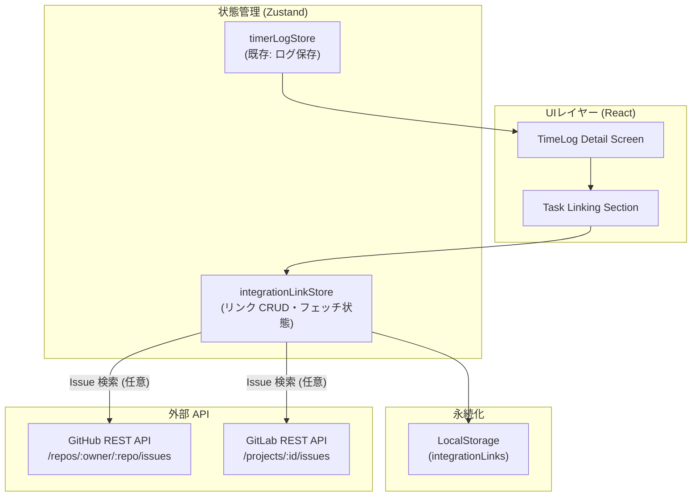
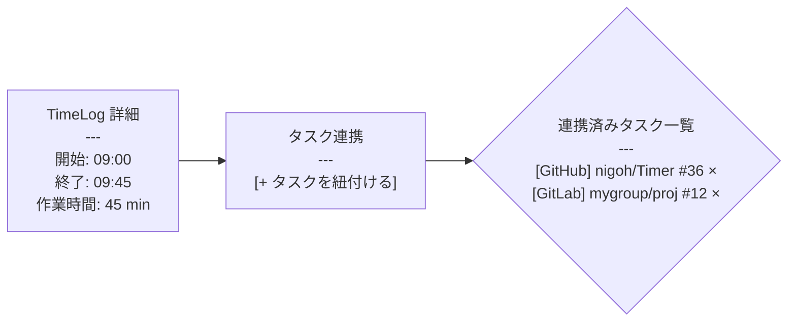

# 設計書: GitHub / GitLab 連携機能（Issue #36）

> **ステータス**: 設計中  
> **対象Issue**: [#36 githubやgitlabなど、プロジェクト管理ツールとの連携ができるようにしたい。](https://github.com/nigoh/Timer/issues/36)  
> **関連ドキュメント**: [REQUIREMENTS.md](./REQUIREMENTS.md) / [TECHNICAL_SPECS.md](./TECHNICAL_SPECS.md)

---

## 1. 概要・目標

タイマーアプリで記録した作業ログ（TimeLog）を、GitHub Issues / GitLab Issues などの外部プロジェクト管理ツールと紐付け可能にする。

**主な目標**

- タスク（Issue）ごとの実績時間を可視化する。
- 外部ツールへの手動転記を不要にする（ローカル連携の記録を残す）。
- ランタイムコード変更は将来フェーズとし、本ドキュメントでは設計を確定する。

**スコープ外（本フェーズ）**

- 外部ツールへの自動コメント投稿・Issue ステータス更新
- OAuth フロー（PAT による手動認証を先行する）

---

## 2. アーキテクチャ概要



---

## 3. UI ワイヤーフレーム

### 3.1 TimeLog 詳細画面 — タスク連携セクション



**ASCII モックアップ**

```
┌─────────────────────────────────────────────────────┐
│  ⏱  TimeLog 詳細                                    │
│─────────────────────────────────────────────────────│
│  開始   2026-02-19 09:00                            │
│  終了   2026-02-19 09:45                            │
│  時間   45 分                                        │
│  メモ   設計書作成                                   │
│─────────────────────────────────────────────────────│
│  🔗 タスク連携                                       │
│                                                     │
│  [GitHub] nigoh/Timer #36  ✕                        │
│  [GitLab] mygroup/proj #12 ✕                        │
│                                                     │
│  [ + タスクを紐付ける ]                              │
│    Provider: [GitHub ▾]  Owner/Repo: [__________]  │
│    Issue #:  [______]    [ 紐付け ]                 │
└─────────────────────────────────────────────────────┘
```

### 3.2 タスク紐付けフォームの UX フロー

1. 「+ タスクを紐付ける」ボタンを押すとインライン入力欄が展開される。
2. Provider（GitHub / GitLab）・Owner/Repo・Issue 番号を入力し「紐付け」を押す。
3. `integrationLinkStore.addLink(timeLogId, link)` が呼ばれ LocalStorage に保存。
4. 連携済みリストにカードが追加される。
5. `×` ボタンで個別リンクを削除できる。

---

## 4. データモデル

```typescript
// src/types/integrationLink.ts

/** 外部タスクへのリンク情報 */
export type IntegrationProvider = "github" | "gitlab";

export interface IntegrationLink {
  /** ローカル一意 ID (crypto.randomUUID) */
  id: string;
  /** 連携プロバイダー */
  provider: IntegrationProvider;
  /** リポジトリ所有者 (GitHub: owner, GitLab: namespace) */
  owner: string;
  /** リポジトリ名 */
  repo: string;
  /** Issue 番号 */
  issueNumber: number;
  /** Issue タイトル (任意キャッシュ) */
  issueTitle?: string;
  /** Issue URL */
  issueUrl: string;
  /** 作成日時 */
  createdAt: string; // ISO 8601
}

/** TimeLog に付加される連携情報 */
export interface TimeLogWithLinks {
  timeLogId: string;
  links: IntegrationLink[];
}
```

> **注意**: `TimeLog` 自体の型は既存の `src/types/` を流用し、`IntegrationLink` を別テーブル（LocalStorage キー: `integration-links`）として管理する。`timeLogId` で JOIN する。

---

## 5. API 連携仕様

外部 API は Issue タイトルの自動補完・検証にのみ使用する（将来フェーズ）。  
**フェーズ 1 では URL とタイトルを手入力**とし、API 呼び出しは行わない。

### 5.1 GitHub REST API（フェーズ 2 候補）

| 用途 | エンドポイント | メソッド |
|------|---------------|---------|
| Issue 取得 | `GET /repos/{owner}/{repo}/issues/{issue_number}` | GET |
| Issue 一覧（検索補助） | `GET /repos/{owner}/{repo}/issues?state=open` | GET |

**認証**: `Authorization: Bearer {PAT}` ヘッダー（PAT は LocalStorage に暗号化保存 ※要検討）

### 5.2 GitLab REST API（フェーズ 2 候補）

| 用途 | エンドポイント | メソッド |
|------|---------------|---------|
| Issue 取得 | `GET /projects/{id}/issues/{issue_iid}` | GET |
| Issue 一覧（検索補助） | `GET /projects/{id}/issues?state=opened` | GET |

**認証**: `PRIVATE-TOKEN: {PAT}` ヘッダー

### 5.3 セキュリティ方針

- PAT はブラウザ上で平文保存しない（フェーズ 2 で実装方法を確定）。
- フェーズ 1 は API 呼び出しなし・URL 手入力のみ。
- CORS 制約がある場合は将来的にプロキシ経由とする。

---

## 6. ストア設計（Zustand）

### 6.1 `integrationLinkStore`

**配置先**: `src/features/timer/stores/integrationLinkStore.ts`

```typescript
// 概念コード（実装は Phase 2 以降）

interface IntegrationLinkState {
  /** timeLogId → IntegrationLink[] のマップ */
  linksByLogId: Record<string, IntegrationLink[]>;
}

interface IntegrationLinkActions {
  /** リンクを追加する */
  addLink: (timeLogId: string, link: Omit<IntegrationLink, "id" | "createdAt">) => void;
  /** リンクを削除する */
  removeLink: (timeLogId: string, linkId: string) => void;
  /** 指定 timeLogId のリンク一覧を返す */
  getLinks: (timeLogId: string) => IntegrationLink[];
}
```

**永続化**: Zustand `persist` ミドルウェア、LocalStorage キー: `integration-links`

### 6.2 既存ストアとの関係

| ストア | 責務 | 変更有無 |
|--------|------|---------|
| `timerLogStore` | 基本タイマーのログ保存 | 変更なし |
| `pomodoroStore` | ポモドーロ状態管理 | 変更なし |
| `integrationLinkStore` | 外部タスク連携（新規） | **新規追加** |

---

## 7. フェーズ別ロールアウト

| フェーズ | 内容 | 成果物 |
|---------|------|--------|
| **Phase 1** | データモデル・ストア実装、手入力 UI（URL + タイトル）、LocalStorage 永続化 | `integrationLinkStore.ts`, `IntegrationLink` 型, TimeLog 詳細 UI 更新 |
| **Phase 2** | GitHub / GitLab API 連携（Issue タイトル自動取得）、PAT 入力 UI | API クライアント, PAT 管理 UI |
| **Phase 3** | 統計ビュー（Issue ごとの合計作業時間）、エクスポート機能 | 統計コンポーネント, CSV/JSON エクスポート |

---

## 8. 未解決事項・検討事項

| # | 項目 | ステータス |
|---|------|-----------|
| 1 | PAT の安全な保存方法（IndexedDB 暗号化 / サーバーサイド proxy） | 未決定 |
| 2 | GitLab Self-hosted への対応（ベース URL 設定 UI） | 検討中 |
| 3 | TimeLog と IntegrationLink の整合性（ログ削除時のリンク孤立） | 未決定 |
| 4 | 複数プロバイダーの同一 Issue 重複登録の扱い | 未決定 |
