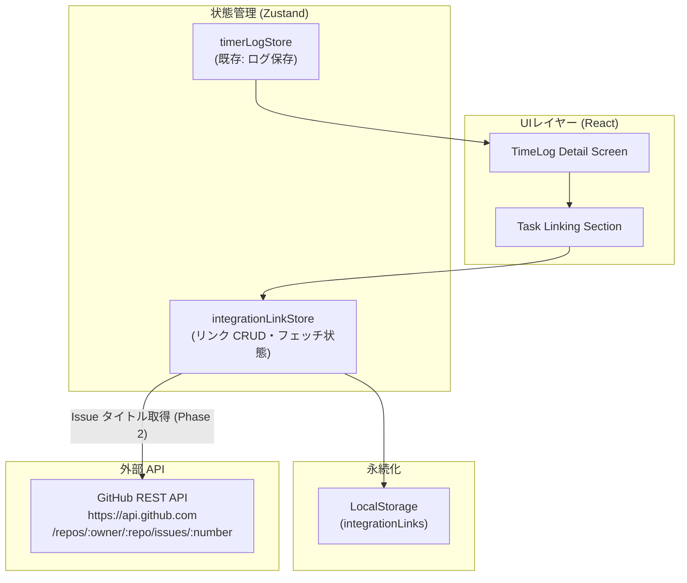

# 設計書: GitHub 連携機能（Issue #36）

> **ステータス**: 設計中  
> **対象Issue**: [#36 githubやgitlabなど、プロジェクト管理ツールとの連携ができるようにしたい。](https://github.com/nigoh/Timer/issues/36)  
> **関連ドキュメント**: [REQUIREMENTS.md](./REQUIREMENTS.md) / [TECHNICAL_SPECS.md](./TECHNICAL_SPECS.md)

---

## 1. 概要・目標

タイマーアプリで記録した作業ログ（TimeLog）を、**GitHub Issues** と紐付け可能にする。GitLab 対応は将来フェーズとして設計上の拡張余地を残す。

**主な目標**

- タスク（Issue）ごとの実績時間を可視化する。
- 外部ツールへの手動転記を不要にする（ローカル連携の記録を残す）。
- ランタイムコード変更は将来フェーズとし、本ドキュメントでは設計を確定する。

**スコープ外（本フェーズ）**

- GitLab 対応（将来フェーズ）
- 外部ツールへの自動コメント投稿・Issue ステータス更新
- OAuth フロー（PAT による手動認証を先行する）

---

## 2. アーキテクチャ概要



---

## 3. UI ワイヤーフレーム

### 3.1 TimeLog 詳細画面 — タスク連携セクション


**ASCII モックアップ**

```
┌─────────────────────────────────────────────────────┐
│  ⏱  TimeLog 詳細                                    │
│─────────────────────────────────────────────────────│
│  開始   2026-02-19 09:00                            │
│  終了   2026-02-19 09:45                            │
│  時間   45 分                                        │
│  メモ   設計書作成                                   │
│─────────────────────────────────────────────────────│
│  🔗 GitHub Issue 連携                                │
│                                                     │
│  [GitHub] nigoh/Timer #36  ✕                        │
│                                                     │
│  [ + GitHub Issue を紐付ける ]                       │
│    Owner/Repo: [__________]  Issue #: [______]      │
│    [ 紐付け ]                                        │
└─────────────────────────────────────────────────────┘
```

### 3.2 タスク紐付けフォームの UX フロー

1. 「+ GitHub Issue を紐付ける」ボタンを押すとインライン入力欄が展開される。
2. Owner/Repo・Issue 番号を入力し「紐付け」を押す。
3. `integrationLinkStore.addLink(timeLogId, link)` が呼ばれ LocalStorage に保存。
4. 連携済みリストにカードが追加される。
5. `×` ボタンで個別リンクを削除できる。

---

## 4. データモデル

```typescript
// src/types/integrationLink.ts

/** 外部タスクへのリンク情報 */
export interface IntegrationLink {
  /** ローカル一意 ID (crypto.randomUUID) */
  id: string;
  /** リポジトリ所有者 */
  owner: string;
  /** リポジトリ名 */
  repo: string;
  /** Issue 番号 */
  issueNumber: number;
  /** Issue タイトル (任意キャッシュ: Phase 2 で API から自動取得) */
  issueTitle?: string;
  /** GitHub Issue URL */
  issueUrl: string;
  /** 作成日時 */
  createdAt: string; // ISO 8601
}

/** TimeLog に付加される連携情報 */
export interface TimeLogWithLinks {
  timeLogId: string;
  links: IntegrationLink[];
}
```

> **注意**: `TimeLog` 自体の型は既存の `src/types/` を流用し、`IntegrationLink` を別テーブル（LocalStorage キー: `integration-links`）として管理する。`timeLogId` で JOIN する。

---

## 5. API 連携仕様

### 5.1 方針

GitHub REST API（`https://api.github.com`）をブラウザから直接呼び出す。  
GitHub API は CORS を許可しているため、フロントエンドから直接 `fetch` で呼び出せる。プロキシは不要。

| フェーズ | API 呼び出し | 内容 |
|---------|------------|------|
| **Phase 1** | なし | Owner/Repo・Issue 番号・タイトルを手入力。URL は `https://github.com/{owner}/{repo}/issues/{number}` で自動生成する |
| **Phase 2** | あり | Issue 番号入力後に API でタイトルを自動取得する |

### 5.2 使用エンドポイント（Phase 2）

```
GET https://api.github.com/repos/{owner}/{repo}/issues/{issue_number}
```

**レスポンス（利用フィールドのみ）**

```json
{
  "number": 36,
  "title": "githubやgitlabなど、プロジェクト管理ツールとの連携ができるようにしたい。",
  "html_url": "https://github.com/nigoh/Timer/issues/36",
  "state": "open"
}
```

### 5.3 認証とセキュリティ

#### ケース別認証方式

| ケース | 方法 | 備考 |
|--------|------|------|
| **Public リポジトリ** | 認証なし | レート制限: 60 req/h。**PAT 不要のため最も安全** |
| **Private リポジトリ** | `Authorization: Bearer {PAT}` ヘッダー | レート制限: 5000 req/h |

#### PAT をブラウザで扱う場合のリスクと対策

ブラウザ SPA で PAT を保持することには本質的な XSS リスクが伴う。各保管方式のリスクを以下に整理する。

| 保管方式 | XSS 耐性 | タブ閉後 | 推奨度 |
|---------|---------|---------|-------|
| `localStorage` | ❌ 低い（常時読取可） | 残存 | **禁止** |
| `sessionStorage` | ❌ 低い（同セッション読取可） | 消去 | 非推奨 |
| メモリのみ（React state） | ✅ 相対的に高い | 消去 | **推奨** |
| 保管しない（毎回入力） | ✅ 最も安全 | — | **最優先** |

**推奨方針**

1. **Phase 1・Phase 2 ともに、まず Public リポジトリのみを対象とする**。認証なしで動作するため PAT の保管問題自体が発生しない。
2. Private リポジトリ対応が必要な場合は、PAT をメモリ（React state / Zustand の非永続フィールド）にのみ保持し、**ページリロードで破棄**する。`localStorage` / `sessionStorage` への保存は行わない。
3. PAT には最小権限スコープ（`public_repo` または `repo` の read-only）のみを要求する旨を UI で案内する。
4. HTTPS（GitHub Pages）上での利用を前提とする。

### 5.4 エラーハンドリング

| HTTP ステータス | 原因 | UIへの伝え方 |
|----------------|------|------------|
| 404 | リポジトリ or Issue が存在しない | 「Issue が見つかりません」トースト |
| 401 / 403 | 認証失敗 / 権限なし | 「認証エラー: PAT を確認してください」トースト |
| 429 | レート制限超過 | 「しばらく時間をおいて再試行してください」トースト |

---

## 6. ストア設計（Zustand）

### 6.1 `integrationLinkStore`

**配置先**: `src/features/timer/stores/integrationLinkStore.ts`

```typescript
// 概念コード（実装は Phase 1 以降）

interface IntegrationLinkState {
  /** timeLogId → IntegrationLink[] のマップ */
  linksByLogId: Record<string, IntegrationLink[]>;
}

interface IntegrationLinkActions {
  /** リンクを追加する */
  addLink: (timeLogId: string, link: Omit<IntegrationLink, "id" | "createdAt">) => void;
  /** リンクを削除する */
  removeLink: (timeLogId: string, linkId: string) => void;
  /** 指定 timeLogId のリンク一覧を返す */
  getLinks: (timeLogId: string) => IntegrationLink[];
}
```

**永続化**: Zustand `persist` ミドルウェア、LocalStorage キー: `integration-links`

### 6.2 既存ストアとの関係

| ストア | 責務 | 変更有無 |
|--------|------|---------|
| `timerLogStore` | 基本タイマーのログ保存 | 変更なし |
| `pomodoroStore` | ポモドーロ状態管理 | 変更なし |
| `integrationLinkStore` | 外部タスク連携（新規） | **新規追加** |

---

## 7. フェーズ別ロールアウト

| フェーズ | 内容 | 成果物 |
|---------|------|--------|
| **Phase 1** | データモデル・ストア実装、手入力 UI（Owner/Repo + Issue 番号 + タイトル）、LocalStorage 永続化 | `integrationLinkStore.ts`, `IntegrationLink` 型, TimeLog 詳細 UI 更新 |
| **Phase 2** | GitHub REST API 連携（Issue タイトル自動取得）、PAT 入力 UI（Private リポジトリ対応） | GitHub API クライアント, PAT 管理 UI, エラーハンドリング |
| **Phase 3** | 統計ビュー（Issue ごとの合計作業時間）、エクスポート機能 | 統計コンポーネント, CSV/JSON エクスポート |

---

## 8. 未解決事項・検討事項

| # | 項目 | ステータス |
|---|------|-----------|
| 1 | Private リポジトリ対応の要否（不要であれば PAT 問題ごと消える） | **未決定** |
| 2 | PAT をメモリ保持とした場合の UX（ページリロードごとに再入力を許容できるか） | 未決定 |
| 3 | TimeLog と IntegrationLink の整合性（ログ削除時のリンク孤立） | 未決定 |
| 4 | 同一 Issue の重複登録の扱い | 未決定 |
| 5 | GitLab 対応（将来フェーズ）の設計拡張方針 | 将来検討 |
